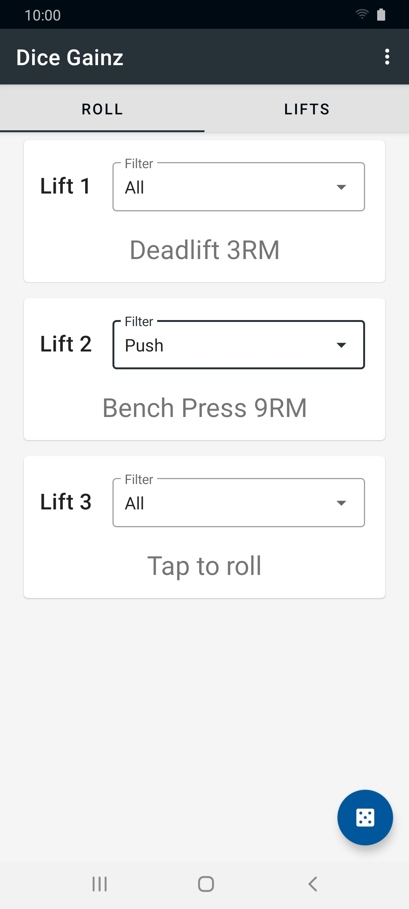

 
<h2 align="center"><b>Dice Gainz</b></h2>
<h4 align="center">A random workout generator based on the <a href="https://redd.it/aqkdgo/">General Gainz</a> training method by <a href="https://swoleateveryheight.blogspot.com/">Cody Lefever</h4>

  <!--  -->
  <a href="https://github.com/ramzan/dicegainz/releases/" alt="GitHub release">Direct APK</a>

 

## Screenshots

### Features

* Create, edit and delete custom lifts
* Categorize your lifts to control the randomness of the roll
* Dark mode

## License
  

Dice Gainz is Free Software: You can use, study share and improve it at your
will. Specifically you can redistribute and/or modify it under the terms of the
[GNU General Public License](https://www.gnu.org/licenses/gpl.html) as
published by the Free Software Foundation, either version 3 of the License, or
(at your option) any later version.  

The app icon is derived from [Dice, gamble, gambling icon](https://www.iconfinder.com/icons/3525384/dice_gamble_gambling_icon) by [Chanut is Industries](https://elements.envato.com/user/Chanut_industries/graphics) under [CC BY 3.0](https://creativecommons.org/licenses/by/3.0/legalcode).

